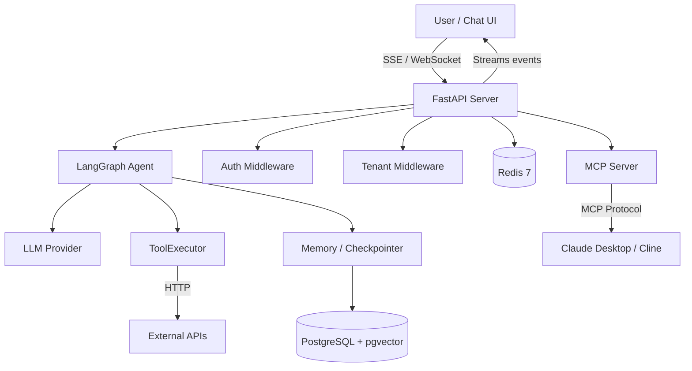
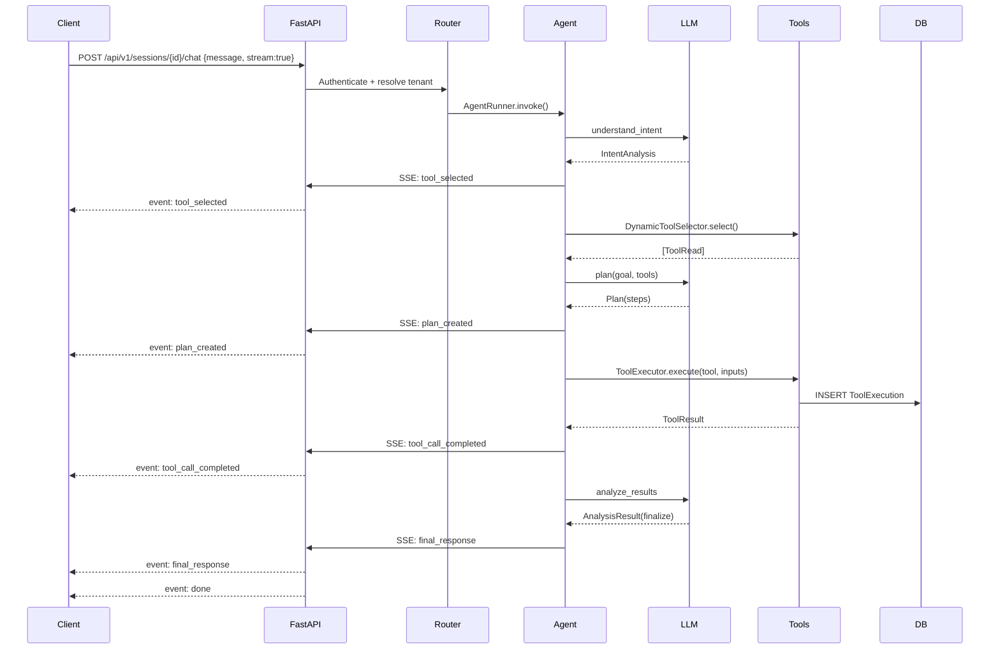
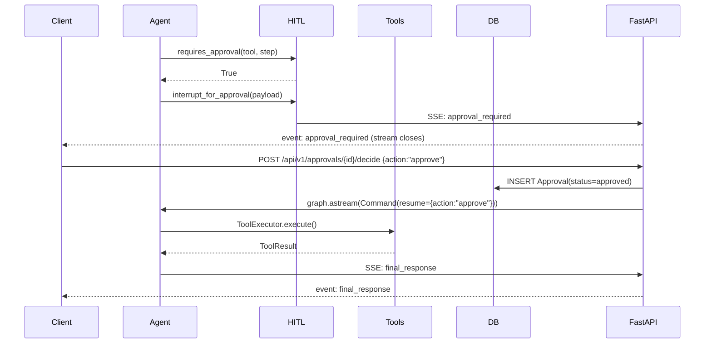
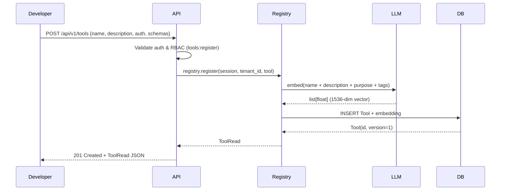
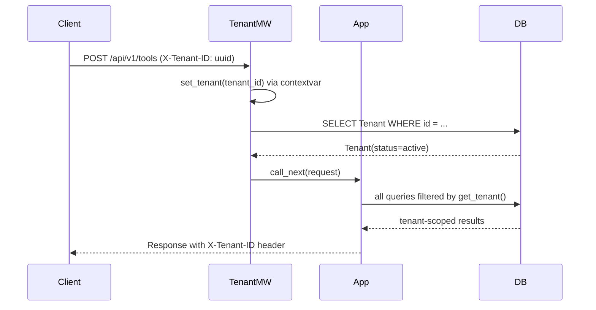
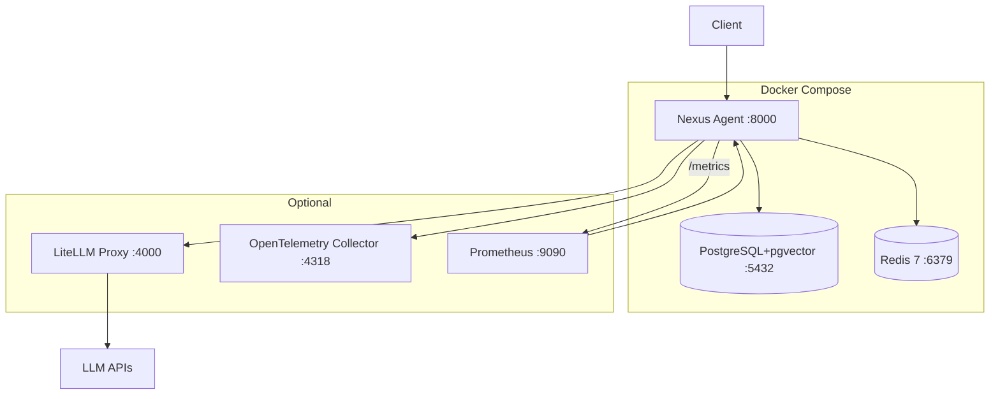
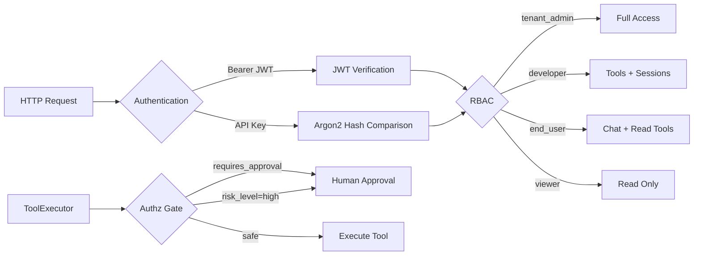

# Architecture

## Overview

Nexus Agent is a standalone, vendor-neutral agentic AI orchestration layer. It exposes a conversational AI that plans, reasons, gathers requirements, and invokes application capabilities via registered tools. The AI contains **zero business logic** — it is a pure orchestration brain that delegates all domain work to tools.

---

## System Context

---

## Component Responsibilities

| Component | Module | Responsibility |
|-----------|--------|---------------|
| **FastAPI Server** | `src/nexus/api/` | HTTP routes, middleware, SSE streaming, websockets |
| **LangGraph Agent** | `src/nexus/agent/` | ReAct + Plan-and-Execute reasoning loop |
| **LLM Client** | `src/nexus/llm/` | Unified interface to 100+ LLM providers (LiteLLM) |
| **Tool Registry** | `src/nexus/tools/` | CRUD, discovery, semantic search, MCP exposure |
| **Tool Executor** | `src/nexus/tools/executor.py` | Outbound HTTP calls with auth, retry, validation |
| **Memory** | `src/nexus/memory/` | Short-term checkpointer + long-term pgvector store |
| **Sessions** | `src/nexus/sessions/` | Conversation history, context window management |
| **HITL** | `src/nexus/agent/hitl.py` | Human-in-the-loop approval interrupts |
| **Auth** | `src/nexus/security/` | JWT, API keys, RBAC, credential vault |
| **Multi-Tenant** | `src/nexus/db/context.py` | contextvar-based tenant isolation |
| **Observability** | `src/nexus/observability/` | OpenTelemetry, structlog, Prometheus metrics |

---

## Data Flow — Chat Turn

---

## Data Flow — HITL Approval

---

## Data Flow — Tool Registration

---

## Data Flow — Multi-Tenant Request

---

## Deployment Architecture

---

## Security Model

---

## Architecture Decision Records

| Decision | Choice | Rationale |
|----------|--------|-----------|
| Agent framework | LangGraph 1.0 | Purpose-built for stateful agents with interrupts, checkpointing |
| LLM abstraction | LiteLLM | 100+ providers, unified API, cost tracking |
| Multi-tenancy | contextvar + tenant_id per row | Zero-copy isolation, no connection overhead |
| HITL mechanism | LangGraph interrupt() | First-class resume support, checkpointing |
| Streaming | SSE (preferred) + WebSocket | Browser-native EventSource, bidirectional fallback |
| Tool protocol | MCP + REST | Industry standard for tool discovery, dual interface |
| Embedding similarity | pgvector (<=> cosine) | In-database search, no external vector store |
| Async runtime | asyncio + FastAPI | Non-blocking I/O, SSE/WebSocket support |
