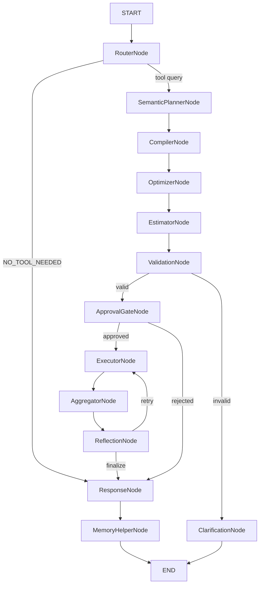

# Nexus Agent — AGENTS.md

## Mission

**Nexus Agent** is a **distributed compiler-inspired orchestration engine** — not a chatbot. It transforms natural language into a 4-layer Intermediate Representation (Intent → Goal → Operation → Execution) via an offline-to-runtime pipeline. All ontology, schema validation, and capability graph generation happens at **compile time** (offline). The runtime is a lean, deterministic executor that reads pre-compiled artifacts.

The AI contains **zero business logic**, **zero hardcoded domain rules**, and **zero runtime ontology lookups** — it is a pure compilation pipeline that delegates all domain work to tools.

---

## Locked Tech Stack

| Layer | Choice | Exact Version | License |
|-------|--------|---------------|---------|
| Language | Python | 3.12+ | PSF |
| Agent orchestration | LangGraph | 1.0 (stable) | MIT |
| Type safety | Pydantic | v2 | MIT |
| Web framework | FastAPI | >=0.135.0 (async, SSE) | MIT |
| LLM abstraction | LiteLLM | latest (unified OpenAI-compatible) | MIT |
| Database | PostgreSQL 16 + pgvector | 16 | PostgreSQL |
| ORM | SQLAlchemy 2.0 async + asyncpg | 2.0 | MIT |
| Migrations | Alembic | — | MIT |
| Cache/queue | Redis | 7 | BSD-3 |
| Tool protocol | Model Context Protocol (MCP) | — | MIT |
| Tool registry | Custom (hybrid with MCP) | — | MIT |
| Tracing | LangSmith | — | — |
| Observability | OpenTelemetry + structlog | — | MIT/Apache 2.0 |
| Testing | pytest + pytest-asyncio + respx + factory-boy | — | MIT |
| Lint | ruff | — | MIT |
| Format | ruff-format | — | MIT |
| Type check | mypy (strict) | — | MIT |
| Package manager | uv | — | Apache 2.0 |
| Containerization | Docker + docker-compose | — | — |

---

## Architecture Principles — The 10-Phase Compiler Architecture

### Phase 1 — IR Refactoring & Registry Augmentation
- **Logical/Physical IR split** (`LogicalNode` → `ToolNode`/`MapNode`/`ReduceNode`/`ConditionalNode`), each with `extra="forbid"`
- `ExecutionGraph` with discriminated union `PhysicalNode`, topological wave ordering
- `BasePhysicalNode.compute_execution_key()` — deterministic SHA256 for idempotency
- Registry columns `logical_op_name`, `batch_strategy`, `intent_profiles`, `input_policy`, `output_contract` on `CapabilityModel`; `cost_per_call`, `latency_p99_ms`, `supports_batch` on `EndpointModel`

### Phase 2 — Offline Registry Compiler
- `nexus compile-registry` CLI — reads DB metadata, validates contracts, produces `CompiledCapabilityGraph`
- 22 tools compiled into 22 capabilities, 22 providers, 22 endpoints, 22 goal templates
- `compiled_graph.py` — configurable path via settings, DB fallback, `invalidate_cache()`, auto-load on `get_compiled_graph()`
- Runtime never computes ontology; it reads the pre-compiled graph

### Phase 3 — Semantic Parser & Caching
- `ParseCache` + `PlanCache` with registry-versioned keys, dual Redis + in-memory backend
- `stats()` API for hit/miss rates, `invalidate_all_caches()` on re-compilation
- Confidence threshold filtering (< 0.3 → flagged for clarification)
- Extraction metadata (model, latency, cache hit/miss) recorded in every response

### Phase 4 — Goal Expansion & 8-Graph System
- `KnowledgeGraphManager` wrapping 8 specialized graphs (Conversation, Artifact, Capability, Ontology, Execution, Memory, Policy, Reasoning)
- `MemoryGraph.load_from_store()` with pgvector retrieval
- O(1) producer/consumer indices on `CapabilityGraph`
- `PolicyGraph` with budget, privacy, SLA, rate limits from settings

### Phase 5 — Resolution & Candidate Sets
- Ontology-based action matching (no stop-word lists, no `if domain ==`)
- Real domain filtering via capability tags + ontology hierarchy
- Multi-candidate ranking (top 3 per goal), not single-best greedy
- Cost-weighted BFS dependency resolution with `depends_on` wiring and cycle detection

### Phase 6 — Plugin-Based Pass Manager & Constraints
- LLVM-style `pass_manager.py` — dynamically discovers passes via `pkgutil.iter_modules`
- 4 core passes: dead task elimination, dependency simplification, parallel fusion, constraint optimizer
- `static_analyzer_node.py` validates optimized DAG against declarative rules
- No hardcoded pass list — all passes loaded dynamically from `passes/` directory

### Phase 7 — True Event-Sourced Executor
- `execution_events` PostgreSQL table — append-only event log
- `append_event()`, `get_events()`, `replay_session()` for full execution history
- Executor does not mutate state — it emits events
- `RetryPolicy` / `CircuitBreakerPolicy` loaded from Provider Contract

### Phase 8 — Stateless Reflection & EWMA Learning
- `ewma_update(alpha=0.3)` — Exponentially Weighted Moving Average for reliability scores
- `update_provider_reliability()` persists scores to `ProviderModel.reliability_score`
- Single failure can't blacklist a provider (EWMA smooths oscillation)
- Reflection node queries compiled graph for alternate providers on failure

### Phase 9 — Incremental Compilation Loop
- `needs_recompilation()` router — checks execution output for reparse/replan/fallback decisions
- Roslyn-style: only re-compile affected sub-graph when tool returns unexpected data
- Preserves `_context_version` across incremental passes

### Phase 10 — Distributed Validation Suite
- 23 end-to-end compiler tests covering IR models, ExecutionContext, caches, passes, EWMA
- IR model creation/validation (`extra="forbid"`), `ExecutionContext apply/branch/replay`
- ParseCache/PlanCache stats and invalidation
- All 4 pass manager optimization passes
- EWMA success/failure scoring

---

## Rule of Law

1. **No Hardcoding** — No `if domain == "weather"`. Use metadata and ontologies. No stop-word lists in resolution logic.
2. **Strict Immutability** — The graph never mutates state. Nodes receive `Context(v)` and return `Context(v+1)` via `StatePatch`. The `@context_node` decorator enforces this automatically.
3. **Offline First** — Ontology lookups, schema validation, and capability graph generation happen at compile time, never at runtime.
4. **Plugins over Ifs** — The Planner and Pass Manager must not contain `if` statements for specific passes. They iterate over dynamically registered passes.
5. **Dynamic Discovery** — All extension points (passes, caches, normalizers) use dynamic discovery (`pkgutil`, `importlib`). No hardcoded registrations.
6. **Sequential Execution** — Complete each phase fully before proceeding to the next.

---

## Graph Architecture — 18 Nodes, 7 Routing Functions



### Routing Functions (4)

| Function | Source | Branches |
|----------|--------|----------|
| `route_after_router` | RouterNode | conversational → ResponseNode; workflow → SemanticPlannerNode |
| `route_after_validation` | ValidationNode | empty workflow → ResponseNode; valid → ApprovalGateNode; invalid → ClarificationNode |
| `route_after_approval` | ApprovalGateNode | approved → ExecutorNode; rejected/unapproved → ResponseNode |
| `route_after_reflection` | ReflectionNode | retry → ExecutorNode (sub-graph); finalize → ResponseNode |

### Node Details

| Node | Dependencies | Behaviour |
|------|-------------|-----------|
| `RouterNode` | `llm`, `model` | Two-stage query classifier (heuristic + LLM fallback). Sets `_query_type`, `_preferred_tools` |
| `SemanticPlannerNode` | `llm`, `model` | Cache-first LLM call → `LogicalWorkflow` JSON with `instructor` `Literal` enforcement. Uses `@context_node` |
| `CompilerNode` | `db_session` | Deterministic codegen: `CapabilityResolver` + `Compiler.compile()` maps LogicalWorkflow → ExecutionGraph. Uses `@context_node` |
| `OptimizerNode` | none | PassManager fixpoint optimizer with 6 passes (InputEnrichment, DeadBranch, DepSimplify, BatchFusion, Constraint, Dedup). Uses `@context_node` |
| `EstimatorNode` | none | Cost/latency estimation from ToolNode metadata. Budget check from settings. Uses `@context_node` |
| `ValidationNode` | none | Schema/constraint validation. Empty workflow routes to ResponseNode for conversational follow-up |
| `ClarificationNode` | none | Asks for missing info, ends graph |
| `ApprovalGateNode` | none | HITL check per tool `risk_level`. Routes rejected execution to ResponseNode |
| `ExecutorNode` | `tool_executor` | Wave-based concurrent execution with per-domain adaptive concurrency + `execution_key` idempotency |
| `AggregatorNode` | none | Pure Python ReduceNode execution (sort, group, average, top-k, filter, summary). Uses `@context_node` |
| `ReflectionNode` | none | Structural graph diffing — builds sub-graph patch for failed tasks, quorum check. Uses `@context_node` |
| `ResponseNode` | `llm`, `model` | Composes final response from tool results or conversation history (native chat for follow-ups) |
| `MemoryHelperNode` | none | Persists session artifacts to pgvector long-term memory. Uses `@context_node` |
| `ApprovalGateNode` | HITL | Reads tool `risk_level`/`requires_approval`. Per-call scope with inputs, expiry |
| `ExecutorNode` | Execution | Wave-based concurrent tool execution via `ConcurrentExecutor` with placeholder resolution |
| `ReflectionNode` | Reflection | Checks failures, sets `_routing_decision` to retry/finalize based on `_total_retry_count` |
| `ResponseNode` | Response | Composes final response from tool results via LLM or returns existing response |

---

## Project Structure

```
nexus-agent/
├── alembic/                 # Database migrations (6 registry tables added)
├── docs/                    # Architecture & design docs
├── scripts/                 # Seed data, test runners, utilities
│   ├── seed_registry.py     # Populates capability/provider/endpoint from tools
│   ├── web_search_server.py # Mock server for bookmark/echo tools (port 8081)
│   └── run_all_tests.py     # 25-test battery + Agent Killer
├── src/nexus/
│   ├── agent/               # LangGraph graph + 18 nodes
│   │   ├── nodes/           # 14 production nodes
│   │   ├── planners/        # DAG planner + pass manager integration
│   │   ├── executors/       # ConcurrentExecutor with placeholder resolution
│   │   ├── registry/        # Runtime intent/capability registries (legacy)
│   │   ├── node_wrapper.py  # @context_node decorator
│   │   └── state_schema.py  # AgentState with _ir_stack, _context_version
│   ├── api/                 # FastAPI routes & middleware
│   ├── compiler/            # IR models, registry compiler, cache, pass manager
│   │   ├── passes/          # 4 optimization passes (dynamic discovery)
│   │   ├── ir_models.py     # IntentIR → GoalIR → OperationIR → ExecutionIR
│   │   ├── cache.py         # ParseCache + PlanCache with stats
│   │   ├── pass_manager.py  # LLVM-style pass discovery and execution
│   │   ├── registry_compiler.py  # Offline compiler + CLI
│   │   └── compiled_graph.py     # Runtime reader with DB fallback
│   ├── config/              # Pydantic BaseSettings
│   ├── db/models/           # SQLAlchemy ORM models (+ 4 registry models)
│   ├── errors/              # Exception hierarchy
│   ├── execution/           # ExecutionContext, StatePatch, EventStore
│   ├── graph/               # KnowledgeGraph (8 specialized graphs)
│   ├── llm/                 # LiteLLM integration
│   ├── memory/              # PostgresSaver + MemoryStore (pgvector)
│   ├── metrics/             # EWMA reliability store
│   ├── middleware/           # Custom ASGI middleware
│   ├── redis_client/        # Redis cache & pub/sub
│   ├── security/            # AuthN/Z, rate limiting
│   ├── sessions/            # Session lifecycle
│   ├── tools/               # MCP client + ToolRegistry
│   └── utils/               # Shared utilities
├── tests/
│   ├── test_compiler_e2e.py # 23 compiler tests (IR, context, cache, passes, EWMA)
│   └── test_ephemeral_fields.py  # Ephemeral fields drift test
├── AGENTS.md                # This file — developer & AI coding guide
├── pyproject.toml           # Python project config (+ nexus CLI entry point)
└── README.md                # Project readme
```

---

## Rules

1. **Every public function has a Google-style docstring** with `Args:`, `Returns:`, `Raises:`.
2. **Every Pydantic model has `field(description="...")`** on every field.
3. **LLM calls only in `src/nexus/llm/`** — tool invocation only in `src/nexus/tools/`.
4. **No business logic in prompts** — Prompts describe the agent's role, never domain rules.
5. **All secrets via environment variables** — never hardcoded, never committed.
6. **All migrations must be reversible** — Alembic `downgrade()` always present.
7. **All `_`-prefixed AgentState fields must be in `_EPHEMERAL_FIELDS`** — enforced by `tests/test_ephemeral_fields.py`.
8. **`_structured_context` is NOT ephemeral** — Single Source of Truth across turns.
9. **`_ir_stack` and `_context_version` are NOT ephemeral** — persist across incremental re-compilations.
10. **@context_node detects old vs new pattern** via first-parameter type annotation. Old pattern (`state: AgentState`) passes through. New pattern (`ctx: ExecutionContext`) enforces immutability.

---

## File-Scoped Commands

```bash
# Lint
uv run ruff check .

# Format
uv run ruff format .

# Type check (strict)
uv run mypy src/nexus

# Run all tests
uv run pytest

# Run compiler-specific tests (23 tests)
uv run pytest tests/test_compiler_e2e.py -v

# Run ephemeral fields drift test
uv run pytest tests/test_ephemeral_fields.py -v

# Run DB migrations
uv run alembic upgrade head

# Generate migration
uv run alembic revision --autogenerate -m "description"

# Compile registry (offline)
uv run nexus compile-registry --output compiled_registry.json

# Seed registry from tools
uv run python scripts/seed_registry.py

# Start dev server
uv run uvicorn nexus.main:create_app --factory --host 0.0.0.0 --port 8000 --reload

# Start mock server (bookmark/echo API proxy)
uv run uvicorn scripts.web_search_server:app --host 0.0.0.0 --port 8081 --log-level error
```

---

## Module Responsibilities

### `src/nexus/agent/` — LangGraph Orchestration (19 nodes, intent-first)
- Defines the 19-node StateGraph (Router → Planner → PlanValidator → Compiler →
  Optimizer → Estimator → Validation → Approval → Executor → Aggregator →
  Validator → Recovery → Reflection/Replan → Response → Memory) with
  conditional routing
- `AgentRunner` — wires LLM, compiler, optimizer, executor, event bus, Redis
  distributed lock, the per-invocation **ReasoningBudget**, and the
  `_invocation_status` terminal states
- `@context_node` decorator — enforces `Context(v) → Context(v+1)` immutability
- `state_schema.py` — 3-tier TypedDict with compiler pipeline fields,
  `_EPHEMERAL_FIELDS` (drift-tested)
- `planners/intent_detector.py` — deterministic Tier-1 intent decomposition
- `planners/intent_decomposer_llm.py` — rare Tier-2 LLM decomposer
- `budget.py` — the ReasoningBudget contract (unified replan counter)
- `architecture.py` — the version manifest (ADR 0008)
- `executors/concurrent_executor.py` — Wave-based executor with per-domain
  semaphores, `execution_key` idempotency, idempotency-key stamping,
  authorization, cancellation, and tool-budget reservation

### `src/nexus/compiler/` — Compiler Pipeline
- `ir_models.py` — Logical/Physical IR (LogicalNode → ToolNode/MapNode/ReduceNode/ConditionalNode) with `extra="forbid"`
- `resolver.py` — `CapabilityResolver`: logical op → best endpoint, cost+latency scoring from settings
- `codegen.py` — `Compiler.compile()`: Deterministic codegen, SHA256 IDs, static dataflow analysis, Kahn's algorithm waves
- `cache.py` — ParseCache + PlanCache with registry-versioned keys, stats, invalidation
- `registry/client.py` — `RegistryClient`: cached DB reader for `intent_profiles`, `input_policy`, `output_contract`
- `pass_manager.py` — LLVM-style dynamic pass discovery + fixpoint iteration
- `passes/` — 6 passes: input_enrichment (profile→params, field_mapping, item unwrap), dead_task_elimination, dependency_simplification, parallel_fusion (batch), constraint_optimizer, deduplication

### `src/nexus/execution/` — Execution Core
- `context.py` — `ExecutionContext` with `from_state()`, `to_state_update()`, `apply()`, `branch()`, `replay()`
- `event_store.py` — Append-only PostgreSQL event log for full execution history

### `src/nexus/metrics/` — EWMA Reliability
- `store.py` — `ewma_update()` formula, `update_provider_reliability()` with DB persistence

### `src/nexus/graph/` — Knowledge Graph
- `knowledge_graph.py` — 8 specialized graphs with O(1) producer/consumer indices

### `src/nexus/api/` — FastAPI Application
- Routes: `/tools`, `/sessions`, `/chat` (SSE + JSON), `/approvals`, `/memory`
- SSE streaming with heartbeat keep-alive and per-node timing events
- HITL approval management via checkpointer state injection

### `src/nexus/tools/` — Tool Registry & Execution
- `ToolRegistry` — CRUD, discovery, semantic search, MCP exposure
- `ToolExecutor` — HTTP/MCP execution with retry, auth, sandbox, audit
- `approval_gate` — Risk-based HITL approval checks

### `src/nexus/memory/` — Memory System
- `AsyncPostgresSaver` — LangGraph checkpointer for session persistence
- `MemoryStore` — pgvector long-term memory (episodic, semantic, procedural)

---

## Naming Conventions

| Element | Convention | Example |
|---------|-----------|---------|
| Modules | `snake_case` | `tool_registry.py` |
| Functions/Methods | `snake_case` | `get_session()` |
| Classes/Models | `PascalCase` | `AgentState`, `IRStack` |
| Env vars | `UPPER_CASE` | `DATABASE_URL`, `REDIS_URL` |
| Constants | `UPPER_CASE` | `_MAX_DEPTH` |
| Private members | `_leading_underscore` | `_bfs_shortest_producer()` |
| Tests | `test_<module>_<scenario>` | `test_ir_stack_immutable` |
