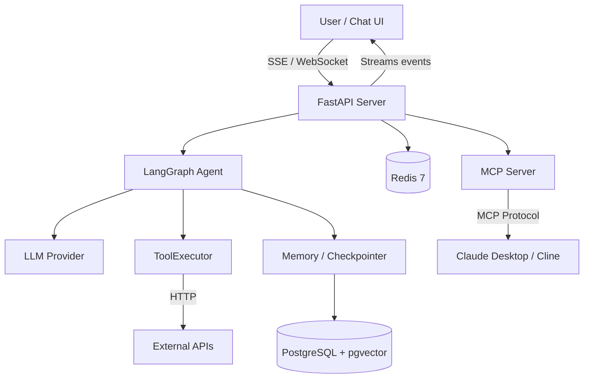
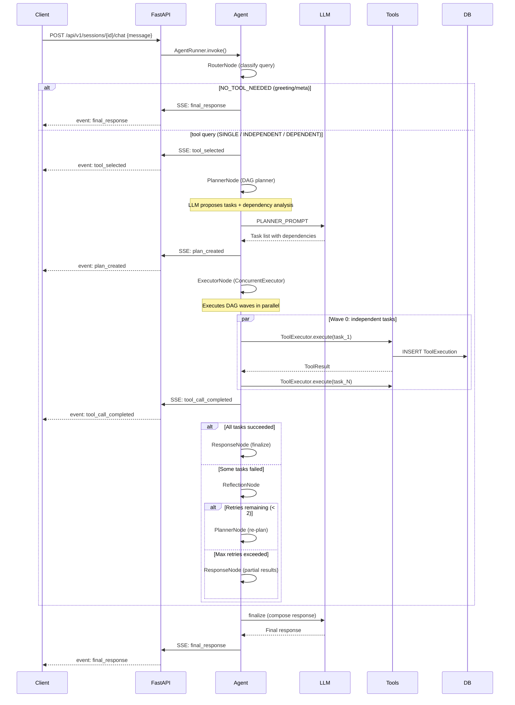
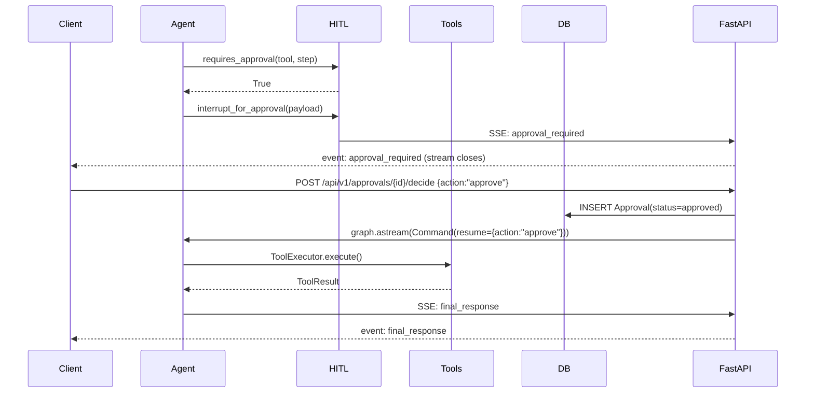
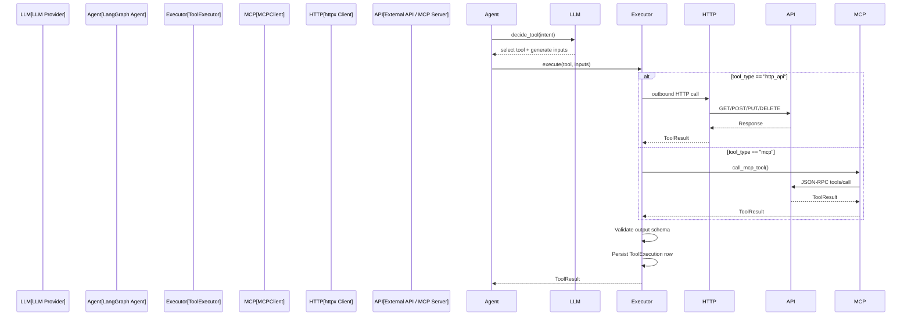
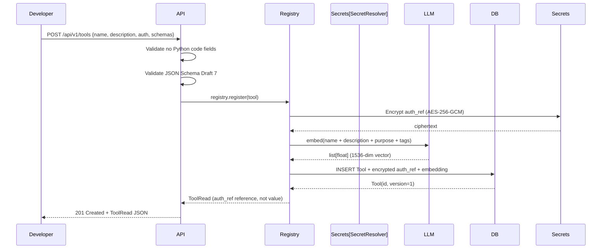
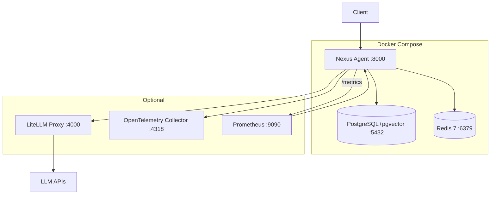

# Architecture

## Overview

Nexus Agent is a standalone, vendor-neutral agentic AI orchestration layer. It exposes a conversational AI that plans, reasons, gathers requirements, and invokes application capabilities via registered tools. The AI contains **zero business logic** — it is a pure orchestration brain that delegates all domain work to tools.

---

## System Context



---

## Component Responsibilities

| Component | Module | Responsibility |
|-----------|--------|---------------|
| **FastAPI Server** | `src/nexus/api/` | HTTP routes, middleware, SSE streaming, websockets |
| **LangGraph Agent (5-node)** | `src/nexus/agent/` | Router → Planner → Executor → Reflection → Response |
| **LLM Client** | `src/nexus/llm/` | Unified interface to 100+ LLM providers (LiteLLM) |
| **Tool Registry** | `src/nexus/tools/` | CRUD, discovery, semantic search, MCP exposure |
| **Tool Executor** | `src/nexus/tools/executor.py` | Executes HTTP API calls and MCP server requests with retry logic — no code execution |
| **Memory** | `src/nexus/memory/` | PostgresSaver checkpointer + pgvector long-term store |
| **Sessions** | `src/nexus/sessions/` | Conversation history, context window management |
| **HITL** | `src/nexus/agent/hitl.py` | Human-in-the-loop approval interrupts (via approval_gate) |
| **Auth** | `src/nexus/security/` | Passthrough auth (no JWT, no RBAC), rate limiting |
| **Logging** | inlined structlog | Structured logging across all modules |
| **Configuration** | `src/nexus/config/` | Pydantic BaseSettings, secret management |
| **Utilities** | `src/nexus/utils/` | Scheduled jobs, constants |

---

## Data Flow — Chat Turn



---

## Data Flow — HITL Approval



---

## Data Flow — API-Only Tool Execution



The executor never executes code. It either makes an HTTP call via httpx
(``http_api``) or sends a JSON-RPC request via MCPClient (``mcp``).
All authentication, sandbox host whitelisting, and rate limiting is applied
before the request leaves the executor.

---

## Data Flow — Tool Registration



---

## Deployment Architecture



---

## Security Model

No authentication. All requests are treated as the default user (passthrough).

### Why No Python Code Execution

Nexus Agent deliberately **does not support** executing arbitrary Python
(or any other language) code as part of tool definitions. This is a
security-by-design decision with the following rationale:

| Risk | Description | Mitigation in Nexus |
|------|-------------|-------------------|
| **Sandbox escape** | Even sandboxed code execution environments have known escape vectors that could expose the host system | No code execution means no sandbox needed |
| **Supply chain attacks** | Code-based tools could pull in malicious dependencies | All tool logic runs externally — no packages installed server-side |
| **Resource exhaustion** | Unbounded code could consume CPU, memory, or disk | HTTP timeout (configurable) enforces resource limits at the network level |
| **Data exfiltration** | Malicious code could read or transmit sensitive data | Tools only receive the data sent as HTTP arguments and only return HTTP responses |
| **Auditability** | Code execution makes it hard to audit what a tool actually did | Every tool call produces a persisted `ToolExecution` row with inputs, outputs, and timing |

If you need custom logic, the recommended approach is to **deploy it as a
separate microservice** and register it as an HTTP API tool. The microservice
handles the custom logic, and Nexus Agent simply calls its HTTP endpoint.
This keeps the agent's attack surface minimal and allows each service to have
its own security controls.

### Credential Encryption

All tool authentication credentials stored in the database are **encrypted at
rest** using AES-256-GCM. The encryption key is derived from the application
secret and is never logged or exposed via the API. On tool execution, the
`SecretResolver` decrypts the credential in memory, injects it into the HTTP
request headers, and discards it after the request completes.

The `auth_ref` field in the tool definition stores a reference (not the
credential itself) using one of these formats:

| Format | Example | Security Level |
|--------|---------|---------------|
| `env:VAR_NAME` | `env:EMAIL_SERVICE_API_KEY` | Medium — env var on server |
| `vault:path` | `vault:secret/tools/email-key` | High — external secret manager |
| `literal:value` | `literal:sk-...` | Low — visible in API responses (dev only) |

---

## Conversational Loop

The agent is **multi-turn** by design. Prior state is loaded from the Postgres checkpointer on each invoke, preserving the accumulated `messages` list for context continuity. Ephemeral fields (`_EPHEMERAL_FIELDS`) are cleared between turns to prevent stale routing state.

```
User message → RouterNode
  ├─ NO_TOOL_NEEDED → ResponseNode → END
  └─ Tool query → PlannerNode → ExecutorNode
       ├─ All tasks done → ResponseNode → END
       └─ Some failed → ReflectionNode
            ├─ Retries left → PlannerNode (loop)
            └─ Max retries → ResponseNode → END
```

## Architecture Decision Records

| Decision | Choice | Rationale |
|----------|--------|-----------|
| Agent framework | LangGraph 1.0 | Purpose-built for stateful agents with interrupts, checkpointing |
| LLM abstraction | LiteLLM | 100+ providers, unified API, cost tracking |
| Single-tenancy | N/A | All data shared, simplified deployment |
| HITL mechanism | LangGraph interrupt() | First-class resume support, checkpointing |
| Streaming | SSE (preferred) + WebSocket | Browser-native EventSource, bidirectional fallback |
| Tool protocol | MCP + REST | Industry standard for tool discovery, dual interface |
| Embedding similarity | pgvector (<=> cosine) | In-database search, no external vector store |
| Async runtime | asyncio + FastAPI | Non-blocking I/O, SSE/WebSocket support |
