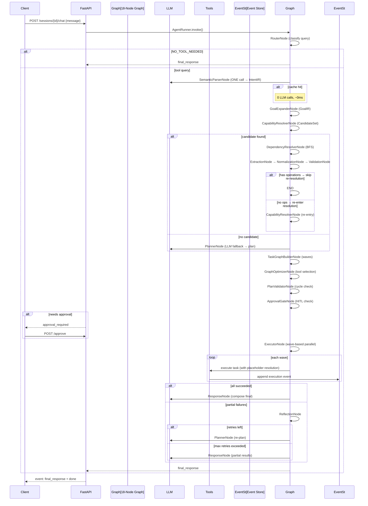

# Architecture — Nexus Agent Compiler Architecture

## Overview

Nexus Agent is a **distributed compiler-inspired orchestration engine**. It transforms natural language into a 4-layer Intermediate Representation (Intent → Goal → Operation → Execution) via an **offline-to-runtime pipeline**. Intelligence (ontology, schema matching, validation) is pushed to the **Offline Registry Compiler**. The runtime uses a **Plugin-based Planner** with **Immutable Versioned Contexts** and **Event Sourcing**.

**Key Design Difference from Chatbots:** The system never mutates state. Nodes receive `Context(v)` and return `Context(v+1)` via `StatePatch`. The `@context_node` decorator enforces this automatically.

---

## System Diagram

```mermaid
graph TB
    subgraph Offline
        DB[(PostgreSQL 16 + pgvector)]
        RC[Offline Registry Compiler<br/>nexus compile-registry]
        CG[CompiledCapabilityGraph JSON]
        DB -->|reads| RC
        RC -->|produces| CG
    end

    subgraph Runtime
        User[User / Chat UI]
        FastAPI[FastAPI Server :8000]
        Mock[Bookmark/Echo Proxy :8081]
        Agent[LangGraph Agent<br/>18 nodes]
        LLM[LLM Provider<br/>(LiteLLM)]
        Executor[ConcurrentExecutor<br/>wave-based]
        EventStore[Execution Events<br/>append-only PG]
        Metrics[EWMA Reliability<br/>metrics/store.py]
        PassMgr[Plugin Pass Manager<br/>4 passes]
        KG[KnowledgeGraph<br/>8 specialized graphs]
        EC[ExecutionContext<br/>Context(v) → Context(v+1)]
        CG2[CompiledCapabilityGraph<br/>compiled_graph.py]
        Cache[ParseCache + PlanCache<br/>Redis + memory]
        Checkpointer[AsyncPostgresSaver<br/>LangGraph checkpointer]
    end

    subgraph Data
        PG[(PostgreSQL)]
        RD[(Redis 7)]
    end

    User -->|SSE / WebSocket| FastAPI
    FastAPI --> Agent
    Agent -->|@context_node| EC
    Agent --> LLM
    Agent --> Executor
    Agent --> KG
    Agent --> Cache
    Agent --> PassMgr
    Agent --> Checkpointer
    Executor --> Mock
    Executor --> EventStore
    EventStore -->|background worker| Metrics
    KG --> CG2
    CG2 --> CG
    Checkpointer --> PG
    Cache --> RD
    FastAPI --> RD
```

---

## The 10-Phase Compiler Architecture

### Phase 1 — Deep IR Stack & Immutable State

**4-Layer Intermediate Representation:**

```
Layer 1: IntentIR      — User's raw semantic intent ("retrieve weather for Tokyo")
Layer 2: GoalIR        — Atomic steps (geocode Tokyo → get weather)
Layer 3: OperationIR   — Capability-bound operations (get_geocoding with {city})
Layer 4: ExecutionIR   — Compiled DAG node with tool binding and retry policy
```

All models use `extra="forbid"` for strict schema enforcement. Each layer validates the next via Pydantic.

**Immutable ExecutionContext:**

```
Context(v)
  ├── version: int          — Monotonic version counter
  ├── parent_version: int   — Enables branching
  ├── snapshot: dict        — Full state at this version
  ├── ir_stack: IRStack     — Typed IRStack model
  └── created_at: str       — ISO timestamp
```

Changes are expressed as `StatePatch` — never direct mutation:
```
StatePatch(version=v+1, updates={...}, removes=[...], ir_stack_update={...})
```

**@context_node decorator:**
- Detects old vs new pattern by inspecting the first parameter's type annotation
- `ctx: ExecutionContext` → full `Context(v) → StatePatch → Context(v+1)` enforcement
- `state: AgentState` or untyped → backward-compat pass-through
- Merges `StatePatch.updates` at the top level for LangGraph routing functions

### Phase 2 — Offline Registry Compiler

```
CLI: nexus compile-registry --output compiled_registry.json
```

Reads DB metadata (CapabilityModel, ProviderModel, EndpointModel, GoalTemplateModel) and produces:
- `CompiledCapabilityNode` — capabilities with consumes/produces/preconditions/postconditions
- `CompiledGoalTemplate` — trigger action → capability chain mappings
- Adjacency matrix (producer → consumer edges)
- Ontology hierarchy (parent → children)
- Missing producers and cycle detection results

**Registry Tables (6):**

| Table | Row Count | Purpose |
|-------|-----------|---------|
| `capability` | 22 | Atomic work units with consumes/produces |
| `provider` | 22 | Service providers with SLA/cost/privacy |
| `endpoint` | 22 | Concrete API endpoints |
| `goal_template` | 22 | Trigger action → capability chain mappings |
| `goal_template_capability` | 22 | Many-to-many association |
| `registry_version` | — | Compile history tracking |

### Phase 3 — Semantic Parser & Caching

```
User message → SemanticParserNode
  ├── ParseCache hit → return cached IntentIR (no LLM)
  └── ParseCache miss → ONE LLM call → list[IntentIR] → cache
```

- SHA256 cache keys include registry checksum (auto-invalidation on re-compilation)
- Confidence filtering: intents below 0.3 flagged for clarification
- Extraction metadata recorded: model, latency, cache hit/miss
- `PlanCache`: hash GoalIR → return cached ExecutionIR (skip planner entirely)

### Phase 4 — Goal Expansion & 8-Graph System

**KnowledgeGraphManager** wraps 8 specialized graphs:

| Graph | Contents | Source |
|-------|----------|--------|
| ConversationGraph | Message history | AgentState.messages |
| ArtifactGraph | Tool outputs with provenance | Resolution output |
| CapabilityGraph | Compiled nodes + O(1) indices | compiled_graph |
| OntologyGraph | Parent → children hierarchy | compiled_graph |
| ExecutionGraph | Current DAG state | Planner output |
| MemoryGraph | Long-term pgvector memories | MemoryStore |
| PolicyGraph | Budget, privacy, SLA, rate limits | Settings |
| ReasoningGraph | LLM thought trail | Observation |

### Phase 5 — Resolution & Candidate Sets

**CapabilityResolverNode** — 3-stage ontology-based elimination:

1. **Action match**: ontology-aware token overlap (no stop-word lists). Checks ontology parent/children for semantic matches.
2. **Domain filter**: capability tags + category + ontology hierarchy
3. **Coverage score**: what % of consumed artifacts are available?

Returns ranked `CandidateSet` (top 3 per goal) with coverage gaps.

**DependencyResolverNode** — cost-weighted BFS on compiled adjacency:
- Shortest producer chain for each missing artifact
- `depends_on` wiring between operations
- Cycle detection via visited set + depth limit

### Phase 6 — Plugin-Based Pass Manager & Constraints

**Dynamic pass discovery:** `pass_manager.py` scans `passes/` via `pkgutil.iter_modules` — no hardcoded pass list.

```python
# Each pass is a module with a run(ir_stack, [kg]) -> ir_stack function
from nexus.compiler.pass_manager import optimize
optimized_stack = optimize(ir_stack, knowledge_graph)
```

**4 Core Passes:**

| Pass | Function | Behaviour |
|------|----------|-----------|
| `pass_dead_task_elimination` | Removes unreferenced operations | Drops ops whose outputs are never consumed |
| `pass_dependency_simplification` | Inlines pass-through ops | Skips intermediate ops that produce same artifact they consume |
| `pass_parallel_fusion` | Merges identical operations | Fuses same-capability + same-input calls |
| `pass_constraint_optimizer` | Selects optimal provider | Reads PolicyGraph for budget/SLA/privacy |

### Phase 7 — True Event-Sourced Executor

Every state change during DAG execution is appended to `execution_events` PostgreSQL table:
- `task_started`, `task_completed`, `task_failed`, `wave_completed`, `execution_completed`
- Full replay: `replay_session(session_id)` returns chronological event list
- Executor reads `RetryPolicy`/`CircuitBreakerPolicy` from Provider Contract

### Phase 8 — Stateless Reflection & EWMA Learning

```python
new_reliability = alpha * observation + (1 - alpha) * current_reliability
# alpha = 0.3, observation = 1.0 (success) or 0.0 (failure)
```

Background worker reads Event Store → updates `ProviderModel.reliability_score` via `update_provider_reliability()`. A single failure cannot blacklist a provider (EWMA provides smooth adaptation).

### Phase 9 — Incremental Compilation Loop

`compiler_router.needs_recompilation()` checks execution output:
- Empty results → reparse (route back to SemanticParserNode)
- Schema violations → reparse
- Transient failures → replan with alternative provider
- Normal completion → proceed to ResponseNode

### Phase 10 — Validation Suite

23 compiler tests covering:
- IR model creation and `extra="forbid"` enforcement
- ExecutionContext `apply()`, `branch()`, `replay()`
- ParseCache/PlanCache stats and invalidation
- All 4 pass manager optimization passes
- EWMA success/failure scoring

---

## Data Flow — Single Chat Turn


```mermaid
sequenceDiagram
    participant Client
    participant FastAPI
    participant Graph[18-Node Graph]
    participant LLM
    participant Tools
    participant EventSt[Event Store]

    Client->>FastAPI: POST /sessions/{id}/chat {message}
    FastAPI->>Graph: AgentRunner.invoke()
    
    Graph->>Graph: RouterNode (classify query)
    alt NO_TOOL_NEEDED
        Graph-->>FastAPI: final_response
    else tool query
        Graph->>LLM: SemanticParserNode (ONE call → IntentIR)
        alt cache hit
            Note over Graph: 0 LLM calls, ~0ms
        end
        Graph->>Graph: GoalExpanderNode (GoalIR)
        Graph->>Graph: CapabilityResolverNode (CandidateSet)
        alt candidate found
            Graph->>Graph: DependencyResolverNode (BFS)
            Graph->>Graph: ExtractionNode → NormalizationNode → ValidationNode
            alt has operations → skip re-resolution
                Graph->>Graph: END
            else no ops → re-enter resolution
                Graph->>Graph: CapabilityResolverNode (re-entry)
            end
        else no candidate
            Graph->>LLM: PlannerNode (LLM fallback → plan)
        end
        
        Graph->>Graph: TaskGraphBuilderNode (waves)
        Graph->>Graph: GraphOptimizerNode (tool selection)
        Graph->>Graph: PlanValidatorNode (cycle check)
        Graph->>Graph: ApprovalGateNode (HITL check)
        alt needs approval
            FastAPI-->>Client: approval_required
            Client->>FastAPI: POST /approve
        end
        Graph->>Graph: ExecutorNode (wave-based parallel)
        loop each wave
            Graph->>Tools: execute task (with placeholder resolution)
            Tools->>EventSt: append execution event
        end
        alt all succeeded
            Graph->>LLM: ResponseNode (compose final)
        else partial failures
            Graph->>Graph: ReflectionNode
            alt retries left
                Graph->>LLM: PlannerNode (re-plan)
            else max retries exceeded
                Graph->>LLM: ResponseNode (partial results)
            end
        end
        Graph-->>FastAPI: final_response
    end
    FastAPI-->>Client: event: final_response + done
```

---

## Graph Topology — 18 Nodes, 7 Routing Functions

```
START → RouterNode
  │
  ├── NO_TOOL_NEEDED → ResponseNode → END
  │
  └── SemanticParserNode → GoalExpanderNode → CapabilityResolverNode
        │                                            │
        │                          ┌─── candidate found → DependencyResolverNode
        │                          │                         │
        │                          │            ┌── ExtractionNode → NormalizationNode
        │                          │            │   → ContextMergeNode → ValidationNode
        │                          │            │                         │
        │                          │            │        ┌── _ready_to_plan + no ops
        │                          │            │        │   → CapabilityResolverNode (LOOP)
        │                          │            │        │
        │                          │            │        └── _ready_to_plan + has ops
        │                          │            │            → END (skip re-resolution)
        │                          │            │
        │                          │            └── TaskGraphBuilderNode → GraphOptimizerNode
        │                          │                             → PlanValidatorNode
        │                          │                ┌── clarify → ClarificationNode → END
        │                          │                │
        │                          │                └── ApprovalGateNode
        │                          │                     │
        │                          │         ┌── rejected → ResponseNode → END
        │                          │         │
        │                          │         └── ExecutorNode
        │                          │              │
        │                          │   ┌── all_ok → ResponseNode → END
        │                          │   │
        │                          │   └── ReflectionNode
        │                          │        │
        │                          │  ┌── retry → PlannerNode → ...
        │                          │  │          (loop if retries remain)
        │                          │  │
        │                          │  └── finalize → ResponseNode → END
        │                          │
        └── no candidate → PlannerNode → PlanValidatorNode → ...
```

---

## Security Model

No authentication — all requests are treated as the default user (passthrough).

### No Python Code Execution

Nexus Agent deliberately does not support executing arbitrary Python code. All tool logic runs externally as HTTP API calls. Every tool call produces a persisted `ToolExecution` row with inputs, outputs, and timing.

### Credential Encryption

Tool authentication credentials are encrypted at rest using AES-256-GCM. The `auth_ref` field stores a reference (`env:VAR_NAME`, `vault:path`, or `literal:value` format). Credentials are decrypted in memory during tool execution and discarded after the request completes.

---

## Deployment

### WSL2 Setup (Full Guide)

1. **Install WSL2 Ubuntu**:
   ```powershell
   wsl --install -d Ubuntu
   ```

2. **Install Python 3.12+ and uv**:
   ```bash
   sudo apt update && sudo apt install -y python3.12 python3.12-venv
   curl -LsSf https://astral.sh/uv/install.sh | sh
   ```

3. **Clone and setup**:
   ```bash
   git clone <repo> && cd nexus-agent
   uv venv && uv sync
   cp .env.example .env
   ```

4. **Start PostgreSQL 16 + Redis**:
   ```bash
   docker compose -f docker/docker-compose.yml up -d
   ```

5. **Run migrations**:
   ```bash
   uv run alembic upgrade head
   ```

6. **Seed registry**:
   ```bash
   uv run python scripts/seed_registry.py
   uv run python -m nexus.compiler.registry_compiler --output compiled_registry.json
   ```

7. **Start mock server** (in a separate terminal):
   ```bash
   uv run uvicorn scripts.web_search_server:app --host 0.0.0.0 --port 8081 --log-level error
   ```

8. **Start backend** (in a third terminal — or use tmux):
   ```bash
   uv run uvicorn nexus.main:create_app --factory --host 0.0.0.0 --port 8000 --reload
   ```

9. **Test the agent**:
   ```bash
   curl -s -X POST http://localhost:8000/api/v1/sessions \
     -H 'Content-Type: application/json' -d '{}' | python3 -c "import sys,json; print(json.load(sys.stdin)['id'])"
   
   SID="<session-id>"
   curl -s -N -X POST "http://localhost:8000/api/v1/sessions/$SID/chat" \
     -H 'Content-Type: application/json' \
     -d '{"message":"Tell me about Pikachu"}' | grep -E 'event: (final_response|done)'
   ```

### Quick tmux Start (WSL2)

```bash
cat > start-all.sh << 'EOF'
#!/bin/bash
# Start PostgreSQL + Redis
sudo docker compose -f $(dirname $0)/docker/docker-compose.yml up -d
sleep 5
# Run migrations
cd $(dirname $0)
uv run alembic upgrade head
# Start mock server (background)
uv run uvicorn scripts.web_search_server:app --host 0.0.0.0 --port 8081 --log-level error &
sleep 2
# Start backend (foreground)
uv run uvicorn nexus.main:create_app --factory --host 0.0.0.0 --port 8000 --reload
EOF
chmod +x start-all.sh
./start-all.sh
```

---

## Architecture Decision Records

| Decision | Choice | Rationale |
|----------|--------|-----------|
| IR approach | 4-layer (Intent → Goal → Operation → Execution) | LLVM-inspired — each layer is a validated transformation of the previous |
| Immutability | `@context_node` + `ExecutionContext.apply()` | Zero mutations; time-travel debugging and branching support |
| Offline compilation | `nexus compile-registry` CLI | Runtime never computes ontology — reads pre-compiled graph |
| Plugin discovery | `pkgutil.iter_modules` dynamic scan | No hardcoded pass list; add passes by creating files in `passes/` |
| Event sourcing | Append-only `execution_events` table | Full replay, time-travel debugging, projection for metrics |
| EWMA reliability | `alpha=0.3` smoothing | Single failure can't blacklist a provider; smooth adaptation to persistent degradation |
| Re-entry loop | Check `_ir_stack.operations` to skip re-resolution | Roslyn-style incremental compilation — only re-compile affected sub-graph |
| Placeholder resolution | `${task_id.result[0].field}` with `_deep_get()` dynamic scan | Supports bracket notation, dot paths, and list navigation for tool chain outputs |
