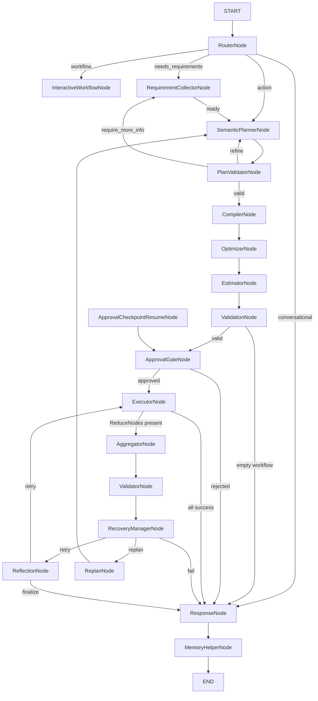

# `src/nexus/agent/` — LangGraph Orchestration (19 Nodes)

> **Runtime Contract** (binding): see
> [`docs/runtime-contract.md`](../../../docs/runtime-contract.md) and the
> binding rulebook [`docs/engineering-principles.md`](../../../docs/engineering-principles.md).
> Highlights: the planner defines *what* (nodes + dependencies), never *how*;
> the executor never replans; validation precedes compilation; every subsystem
> boundary is a typed model; no tool-name logic; the architecture is versioned
> (ADR 0008 — `nexus/agent/architecture.py`, the single cache-key fingerprint).

This module owns the LangGraph StateGraph implementing a **19-node deterministic
workflow compiler** (intent-first). The agent contains **zero business logic** —
it translates natural language into intent units, plans a `LogicalWorkflow` via
LLM, validates it semantically (coverage/alignment/provenance/traceability),
compiles it deterministically, executes under a per-invocation **ReasoningBudget**
with authorized/idempotent/cancellable/sandboxed tool calls, recovers every
failure through the typed recovery state machine, and composes responses that
only claim what artifacts prove.

---

## Key Responsibilities

- `StateGraph` topology with **19 production nodes** + conditional routing.
- `@context_node` decorator — enforces `Context(v) → Context(v+1)` immutability.
- `AgentRunner` — wires LLM, compiler, executor, event bus, checkpointer, Redis
  lock, the per-invocation **ReasoningBudget** (wall-time, graph steps, replans,
  recovery, LLM/tool calls, cost — the runner enforces wall-time + steps), and
  the `_invocation_status` terminal states (RUNNING → COMPLETED / CANCELLED /
  TIMED_OUT / INTERRUPTED).
- **3-prompt architecture**: Router (classifier) → LogicalPlanner (v2.4,
  intent-unit rule) → Finalize (v4.1, untrusted-data boundary).
- **Intent-first planning (P4)**: `IntentDetector` (deterministic Tier-1) +
  the rare Tier-2 LLM decomposer; the PlanValidator checks intent coverage,
  capability alignment, parameter provenance, and traceability.
- **Deterministic compiler**: `Compiler.compile()` includes `RESOLVE(...)`
  producer-chain synthesis (metadata-driven; the frozen IR is rebuilt, never
  mutated).
- **ReasoningBudget (P0)**: one shared replan counter consumed by the validator,
  compiler, and recovery replan loops; the executor reserves tool calls; the
  planner/response reserve LLM calls.
- **Execution gates (P0)**: authorization (capability `allowed_roles`), SSRF
  hardening for dynamic endpoints, idempotency keys (stable across retries),
  and the `uncertain` outcome for mid-call cancellation (never retried).

---

## Graph Architecture — 19 Nodes



### Routing Functions

| Function | Source | Branches |
|----------|--------|----------|
| `route_after_router` | RouterNode | conversational → ResponseNode; workflow → InteractiveWorkflowNode; needs requirements → RequirementCollectorNode; action → SemanticPlannerNode |
| `route_after_requirement_collector` | RequirementCollectorNode | ready → SemanticPlannerNode; need reply → END |
| `route_after_plan_validator` | PlanValidatorNode | proceed → CompilerNode; refine → SemanticPlannerNode; require_more_info → RequirementCollectorNode; abort → ResponseNode |
| `route_after_compiler` | CompilerNode | compile failure → SemanticPlannerNode (bounded by the shared budget) then ResponseNode |
| `route_after_executor` | ExecutorNode | ReduceNodes present → AggregatorNode (reduces on SUCCESS too); workflow resume → InteractiveWorkflowNode; all success → ResponseNode; partial failure → AggregatorNode |
| `route_after_recovery` | RecoveryManagerNode | retry → ReflectionNode; replan → ReplanNode; fail → ResponseNode |
| `route_after_reflection` | ReflectionNode | retry → ExecutorNode (sub-graph); finalize → ResponseNode |

---

## Node Details

| Node | Behaviour |
|------|-----------|
| `RouterNode` | Two-stage classifier (heuristic + LLM fallback) via the GlobalContext O(1) keyword map. Sets `_query_type`, `_goals`, `_preferred_tools`. |
| `RequirementCollectorNode` | Clarifying questions; routes to the planner when ready. |
| `InteractiveWorkflowNode` | Template-driven workflow engine; `_resolve_step_artifacts` chains producers (metadata-driven) for consumed artifacts. |
| `SemanticPlannerNode` | Cache-first LLM → `LogicalWorkflow` (one node per detected intent unit); Tier-2 LLM decomposer on low Tier-1 confidence or intent-class repair failure; replans BYPASS the plan cache. |
| `PlanValidatorNode` | Deterministic semantic validation: undefined ops, cycles (incl. implicit placeholder edges), missing inputs, type/provenance violations, intent coverage, capability alignment, traceability (extraneous ops), missing producer/consumer, budget, policy. Emits typed metrics (`intent_coverage`, `dropped_intents`, `extraneous_operation_rate`, `capability_alignment`). |
| `CompilerNode` | Deterministic codegen + `RESOLVE(...)` producer-chain synthesis; bounded compile-failure replan via the shared budget. |
| `OptimizerNode` | PassManager fixpoint (discovered passes). |
| `EstimatorNode` | Cost/latency + budget check. |
| `ValidationNode` | Structure/constraint validation; empty workflow → response. |
| `ApprovalGateNode` | Conversational approval bound to the **operation hash** (P1): a modified/replanned step is never auto-authorized. |
| `ApprovalCheckpointResumeNode` | approve/reject/cancel/modify/clarify; records the binding hash. |
| `ExecutorNode` | Wave-based concurrent execution; per-domain concurrency; execution-key idempotency; candidate-endpoint fallback; **ReasoningBudget tool-call reservation**; UNCERTAIN outcome on mid-call cancellation; executor ledger flows back. |
| `AggregatorNode` | Pure-Python reduce (runs on success paths too). |
| `ValidatorNode` | Post-execution validation. |
| `RecoveryManagerNode` | Typed-status failure classification; consumes `_validation_failed`; every failure enters the state machine (retry/replan/partial/fail). |
| `ReflectionNode` | Structural graph diffing; sub-graph retry; quorum failure → graceful FAIL (never raises). |
| `ReplanNode` | Consumes the shared replan budget counter (unified with the validator + compiler loops). |
| `ResponseNode` | ContextIR → prompt pipeline → synthesis; untrusted-data boundary (finalize v4.1); data-incorporation + per-artifact coverage guards; deterministic renderer fallback; `_response_coverage` metric; LLM-call budget reservation. |
| `MemoryHelperNode` | pgvector persistence (provenance + freshness attached at the store boundary); never stores failed/degenerate responses. |

---

## Key Files

| File | Responsibility |
|------|---------------|
| `architecture.py` | The version manifest (ADR 0008) — `ArchitectureVersion.current()/cache_fingerprint()/to_json()`, the only architecture version in cache keys. |
| `budget.py` | The `ReasoningBudget` invocation contract (reserve-before-execute, unified replan counter). |
| `graph.py` | `build_agent_graph()` — the 19-node graph + routing. |
| `runner.py` | `AgentRunner` — budget init + wall-time/graph-step enforcement + `_invocation_status` terminal states + SSE translation + outcome persistence (with reproducibility + planner metrics). |
| `state_schema.py` | `AgentState` TypedDict + `_EPHEMERAL_FIELDS` (drift-tested). |
| `contracts.py` | The node-contract registry (inputs/writes/produces per node; drift-tested; the `_invocation_budget`/`_response_coverage` shared channels). |
| `planners/intent_detector.py` | Deterministic Tier-1 intent decomposition (closed grammatical connectors; unit→capability via the registry keyword/alias/name bridge). |
| `planners/intent_decomposer_llm.py` | Rare Tier-2 LLM decomposer (cached, graceful-fail). |
| `nodes/plan_validator_node.py` | The semantic validation core + P4 metrics. |
| `nodes/semantic_parser_node.py` | The planner (intent-unit framing; replan cache-bypass; LLM-budget). |
| `nodes/response.py` | The response lowering (coverage guards + renderer fallback). |
| `executors/concurrent_executor.py` | Wave executor (idempotency keys, authorization, cancellation, tool-budget, artifact registration). |
| `nodes/multi_approval_gate_node.py` / `approval_checkpoint_resume_node.py` | Semantic-bound approvals. |

---

## Invariant Chain (the non-negotiable contract)

```
LLM proposes.  Registry resolves.  Validator verifies (coverage + alignment +
provenance + traceability + budget).  Compiler decides structure (RESOLVE(...)
synthesis).  Executor performs (authorized, idempotent, cancellable,
sandboxed+SSRF-hardened).  Artifacts prove results.  Recovery handles failure
(typed, never silent, unified budget).  Response only claims what artifacts
prove (per-artifact coverage).  Memory remembers with provenance — never
overrides current intent, never stores failures.
```

## Test Coverage

| Test | Type | File |
|------|------|------|
| Handoff invariant gate | Unit | `tests/test_handoff_invariant.py` |
| Architecture version drift | Unit | `tests/test_architecture_versions.py` |
| Plan validator (incl. P4 coverage/alignment/provenance/traceability) | Unit | `tests/test_plan_validator.py` |
| Intent detector | Unit | `tests/test_intent_detector.py` |
| ReasoningBudget | Unit | `tests/test_reasoning_budget.py` |
| Codegen RESOLVE synthesis | Unit | `tests/test_codegen_resolve.py` |
| Adversarial/safety suite | Unit | `tests/test_adversarial.py` |
| Sandbox SSRF | Unit | `tests/test_sandbox_ssrf.py` |
| Contract drift / ephemeral drift | Unit | `tests/test_node_contracts.py`, `tests/test_ephemeral_fields.py` |
| YAML scenario tiers | Integration | `tests/run_scenarios.py` (+ `--tier fast\|medium\|full`) |
| Scenario stability | Integration | `scripts/stability_score.py` (health = ≥3 clean runs) |
| Live scenario matrix | Live | `tests/test_scenario_matrix.py` |

## Dependencies

- `nexus/compiler/` — IR, codegen, pass manager, versioned caches
- `nexus/artifacts/` — ArtifactBase (frozen, content-hashed), normalizer (state-marked), graph, renderer plugins
- `nexus/memory/` — MemoryManager, MemoryStore (provenance + ttl), scout (expiry-filtered), checkpointer
- `nexus/tools/` — ToolRegistry, ToolExecutor (authorization/idempotency/SSRF gates), sandbox
- `nexus/execution/` — ExecutionContext (idempotency_key, user_roles), StatePatch
- `nexus/context/` — GlobalContext (O(1) keyword/alias/capability indexes)
- `nexus/observability/` — InvocationOutcome (architecture fingerprint + planner metrics + reproducibility)
