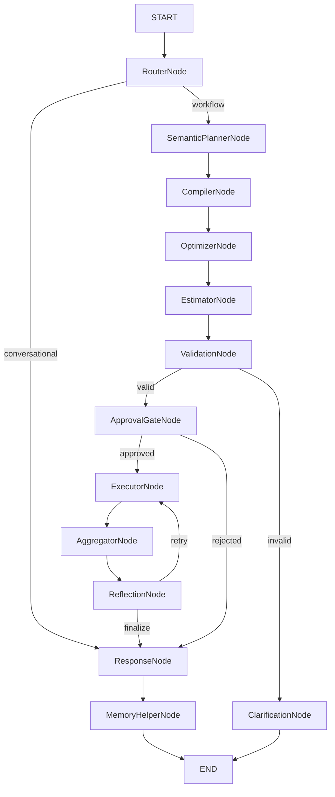

# `src/nexus/agent/` — LangGraph Orchestration (13 Nodes)

This module owns the LangGraph StateGraph that implements a **13-node deterministic workflow compiler**. The agent contains **zero business logic** — it translates natural language to LogicalWorkflow via LLM, compiles to ExecutionGraph via the deterministic Compiler, optimizes via the PassManager, executes tools in parallel via DAG waves, reflects via structural graph diffing, and composes responses via LLM.

---

## Key Responsibilities

- Define `StateGraph` topology with **13 production nodes** and 4 conditional routing functions.
- `@context_node` decorator — enforces `Context(v) → Context(v+1)` immutability via type-annotation detection.
- `AgentRunner` that wires LLM, compiler, optimizer, executor, event bus, checkpointer, and Redis distributed session lock.
- **3-prompt architecture**: Router (classifier) → LogicalPlanner (LogicalWorkflow) → Finalize (response narrative).
- **Deterministic compilation pipeline**: `SemanticPlannerNode` (LLM → LogicalWorkflow) → `CompilerNode` (codegen → ExecutionGraph) → `OptimizerNode` (PassManager fixpoint) → `EstimatorNode` (cost/latency) → `ValidationNode` (schema).
- **Structural graph diffing** in `ReflectionNode` — builds sub-graph patches for retry, no LLM re-entry.
- **Per-domain adaptive concurrency** in `ConcurrentExecutor` — independent semaphores per API domain.
- **execution_key idempotency** — SHA256-based task dedup in the executor.
- **State stores**: `ResultStore` (transient tool outputs), `ArtifactStore` (permanent side-effects), `ExecutionSession` (scoped session).
- Wave-based concurrent tool execution via `ConcurrentExecutor` with `_resolve_placeholders()` for dependency chaining.

---

## Graph Architecture — 13 Nodes

### Routing Functions (4)

| Function | Source | Branches |
|----------|--------|----------|
| `route_after_router` | RouterNode | conversational → ResponseNode; workflow → SemanticPlannerNode |
| `route_after_validation` | ValidationNode | valid → ApprovalGateNode; invalid → ClarificationNode |
| `route_after_approval` | ApprovalGateNode | approved → ExecutorNode; rejected/unapproved → ResponseNode |
| `route_after_reflection` | ReflectionNode | retry → ExecutorNode (sub-graph); finalize → ResponseNode |

---

## Node Details

| Node | Dependencies | Behaviour |
|------|-------------|-----------|
| `RouterNode` | `llm`, `model` | Two-stage query classifier (heuristic + LLM fallback). Sets `_query_type`, `_preferred_tools` |
| `SemanticPlannerNode` | `llm`, `model` | Cache-first LLM call → `LogicalWorkflow` JSON. Uses `@context_node` |
| `CompilerNode` | `db_session` | Deterministic codegen: `Compiler.compile()` maps LogicalWorkflow → ExecutionGraph. Uses `@context_node` |
| `OptimizerNode` | none | PassManager fixpoint optimizer — runs all discovered passes on ExecutionGraph. Uses `@context_node` |
| `EstimatorNode` | none | Cost/latency estimation from ToolNode metadata. Budget check. Uses `@context_node` |
| `ValidationNode` | none | Schema/constraint validation of the optimized graph |
| `ClarificationNode` | none | Asks for missing info, ends graph |
| `ApprovalGateNode` | none | HITL check per tool risk level. Per-call scope with inputs, approval expiry |
| `ExecutorNode` | `tool_executor` | Wave-based concurrent execution with per-domain adaptive concurrency + execution_key idempotency |
| `AggregatorNode` | none | Pure Python ReduceNode execution (sort, group, average, top-k, filter, summary). Uses `@context_node` |
| `ReflectionNode` | none | Structural graph diffing — builds sub-graph patch for failed tasks, quorum check. Uses `@context_node` |
| `ResponseNode` | `llm`, `model` | Composes final response from tool results via LLM |
| `MemoryHelperNode` | none | Persists session artifacts to pgvector long-term memory. Uses `@context_node` |

---

## Key Files

| File | Responsibility |
|------|---------------|
| `graph.py` | `build_agent_graph()` — 13-node graph with 4 conditional routing functions |
| `node_wrapper.py` | `@context_node` decorator — dynamic old/new pattern detection via type annotation |
| `runner.py` | `AgentRunner` — module-level graph cache, `invoke()` async generator, Redis distributed lock. SSE event translation |
| `state_schema.py` | `AgentState` TypedDict (70+ fields). 33 `_EPHEMERAL_FIELDS` |
| `compiler_router.py` | Incremental compilation: `needs_recompilation()` with structural graph diffing |
| `planners/dag_planner.py` | Lightweight shim — calls LLM → Compiler → ExecutionPlan |
| `executors/concurrent_executor.py` | Wave-based executor with per-domain semaphores, execution_key idempotency |
| `router.py` | Two-stage query classifier (heuristic + LLM fallback). `QueryType` enum |
| `checkpoint_manager.py` | Named checkpoint lookup |
| `metrics.py` | Post-execution metrics extraction |
| `nodes/semantic_parser_node.py` | Cache-first LLM → `LogicalWorkflow` via capability catalog |
| `nodes/compiler_node.py` | Calls `Compiler.compile()` with DB session |
| `nodes/optimizer_node.py` | Calls PassManager fixpoint optimizer |
| `nodes/estimator_node.py` | Cost/latency estimation and budget check |
| `nodes/aggregator_node.py` | Pure Python ReduceNode execution (6 aggregate kinds) |
| `nodes/reflection_node.py` | Structural graph diffing, sub-graph patching, quorum check |
| `nodes/memory_helper_node.py` | pgvector persistence + `persist_after_response()` utility |
| `prompts/logical_planner.py` | LogicalWorkflow JSON prompt (replaces old extraction + planner prompts) |

---

## LLM Call Counts Per Query Type

| Query Type | LLM Calls | Path |
|------------|-----------|------|
| Greeting / Meta ("Hi", "What tools?") | 0 | RouterNode → ResponseNode |
| Single-tool ("Get weather in Tokyo") | 2 | SemanticPlanner + ResponseNode |
| Multi-tool ("Compare stocks") | 2 | SemanticPlanner + ResponseNode |
| Retry (on partial failure) | 0 | ReflectionNode → ExecutorNode (sub-graph retry, no LLM) |
| Clarification | 0 | ValidationNode → ClarificationNode → END |

---

## Events Emitted

| Event | Payload | Emitted By |
|-------|---------|------------|
| `node_completed` | `{node, duration_ms, has_output}` | Every node |
| `tool_selected` | `{intent, parameters}` | RouterNode |
| `plan_created` | `{logical_workflow, execution_graph}` | SemanticPlannerNode / CompilerNode |
| `optimization_finished` | `{snapshots: [{pass_name, nodes_before, nodes_after}]}` | OptimizerNode |
| `tool_call_completed` | `{tool_name, status, data, error, task_id}` | ExecutorNode per tool |
| `final_response` | `{text}` | ResponseNode / ClarificationNode |
| `approval_required` | `{pending_tools, message}` | ApprovalGateNode |
| `reflection_result` | `{decision, patched_nodes}` | ReflectionNode |
| `graph_patched` | `{failed_nodes}` | ReflectionNode (on retry) |
| `error` | `{message}` | Any node |

---

## State Schema

| Tier | Fields | Checkpointed |
|------|--------|-------------|
| `persistent` | `session_id`, `user_context`, `approved_tools`, `config_overrides` | Always |
| `working` | `messages` (reducer), `current_plan`, `tool_results_buffer` (reducer), `gathered_requirements` | Per-turn |
| `cost` | `total_cost_usd`, `total_tokens`, `per_node` | Per-turn |
| Compiler IR | `_logical_workflow` (dict), `_execution_graph` (dict), `_context_version` (int) | **Not** ephemeral |
| Ephemeral | 33 `_`-prefixed fields (routing, execution, extraction) | Cleared between turns |

---

## Reducers

| Field | Reducer | Behaviour |
|-------|---------|-----------|
| `messages` | `messages_reducer` | Rolling window (last 10 + milestones), dedup by ID |
| `tool_results_buffer` | `tool_results_reducer` | Append-only, hard bound at 20 entries |

---

## Test Coverage

| Test | Type | File |
|------|------|------|
| Ephemeral Fields Drift | Unit | `tests/test_ephemeral_fields.py` |
| Compiler E2E (23 tests) | Unit | `tests/test_compiler_e2e.py` |
| YAML Scenario Runner | Integration | `tests/run_scenarios.py` |

---

## Dependencies

- `nexus/compiler/` — IR models, codegen, pass manager, cache, registry compiler
- `nexus/execution/` — ExecutionContext, StatePatch, EventStore, ResultStore, ArtifactStore
- `nexus/graph/` — KnowledgeGraph (8 graphs)
- `nexus/metrics/` — EWMA reliability store
- `nexus/llm/` — LLMClient for all model calls
- `nexus/tools/` — ToolRegistry, ToolExecutor, DynamicToolSelector, approval_gate
- `nexus/sessions/` — SessionService, ContextWindowManager
- `nexus/memory/` — MemoryManager, AsyncPostgresSaver checkpointer, MemoryStore
- `nexus/redis_client/` — EventBus, distributed lock
- `nexus/db/` — async session factory
